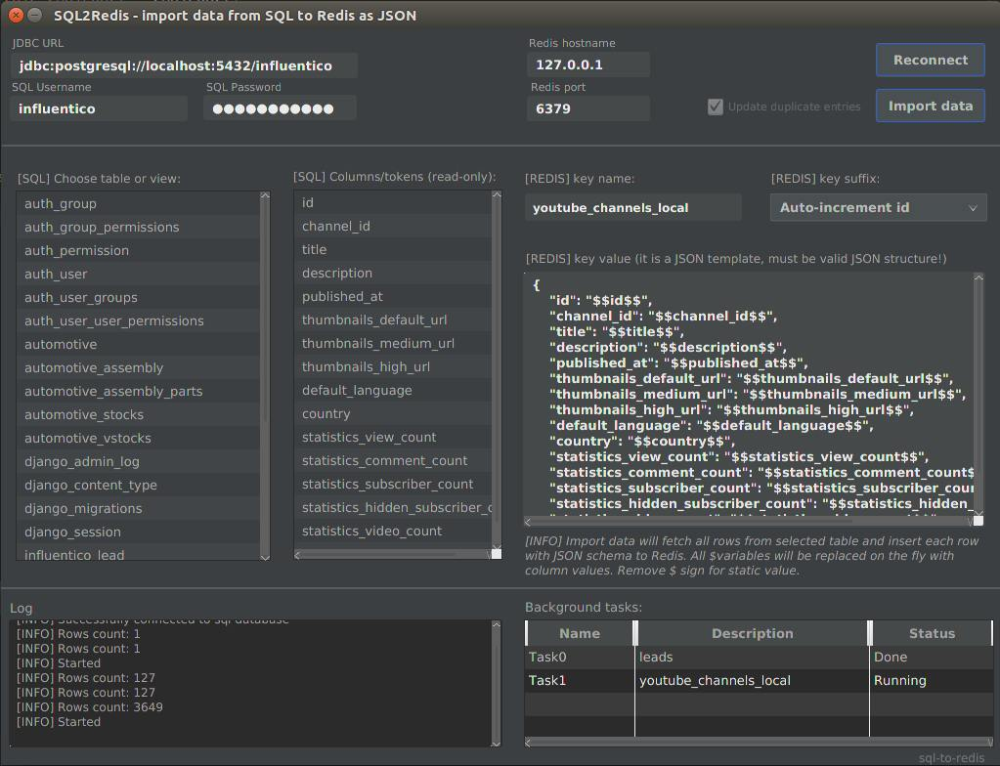

# SQL to Redis (sql2redis) #


Very simple Java app. My first usage of JavaFx. Created for my tests and development reasons. Sql2redis can be used to export and transform data from sql database tables to redis (storing with JSON format).

How to run:
-----------

* (optional) Get latest JRE from Oracle website (currently the newest is JRE 1.8.0_112)
* Get JAR file [download](https://github.com/mojeprojekty/sql2redis/raw/master/out/artifacts/sql2redis_jar/sql2redis.jar)
* Just check Java version:
  ```
  user@localhost:~$ java -version
  java version "1.8.0_112"
  Java(TM) SE Runtime Environment (build 1.8.0_112-b15)
  Java HotSpot(TM) 64-Bit Server VM (build 25.112-b15, mixed mode)
  ```
* Go to downloaded JAR file and run command:
  ```
  java -jar sql2redis.jar
  ```
DB support:
-----------
| SQL databases | Support |
| ------------- |:-------:|
| PostgreSQL    | Yes     |
| MySQL         | Yes     |
| Oracle        | Not yet |

Details:
-----------
* all queries run using Connection/ResultSets classes
* fetchSize of Statement is hardcoded and it is set to 40,000 rows (import 7 milion rows takes few minutes, but if you have bigger tables you can decrease this value)
* all connections to sql use Connection class from DriverManager
* all imports are run as background task , threads


How to use:
-----------
* prepare connection string and setup sql/redis hosts,
* choose table to import,
* modify (if you want) JSON schema
* choose redis key name (default value is table name)
* choose redis suffix (value should be unique if not then you will override previouse keys, you can choose column value - so your SQL PK can be saved, default value is autoincrement id from loop)
* in JSON schema, all $$words$$ are variables, they will be replaced on the fly with row values



Thanks for drivers/dbs to:
-----------
* Jedis (https://github.com/xetorthio/jedis),
* PostgreSQL,
* Redis.
